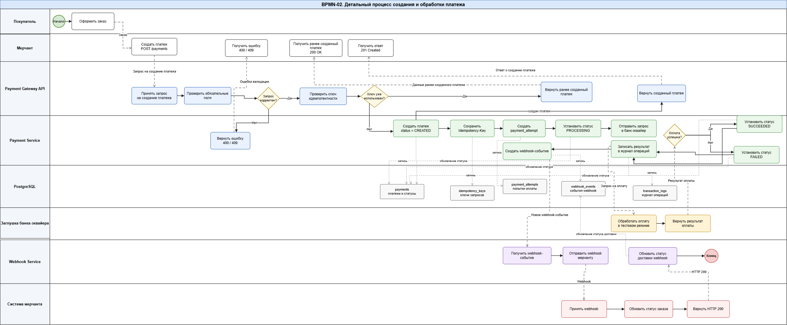
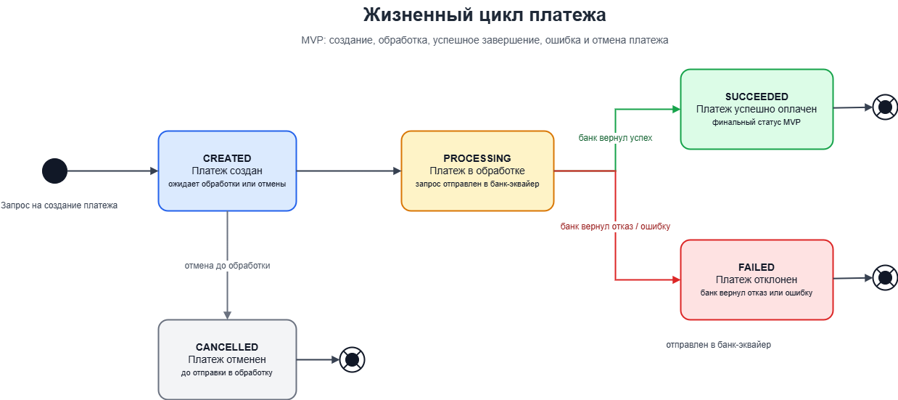
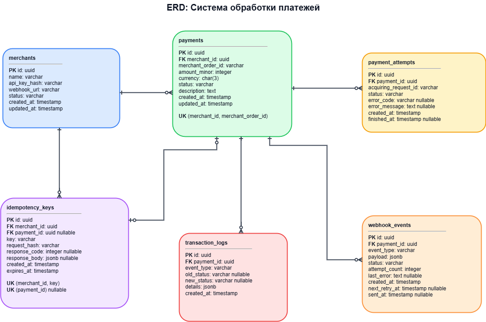
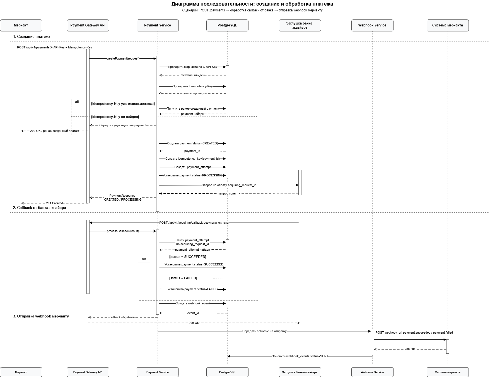

# Система обработки платежей / Payment Gateway System Analysis

Проект по системному анализу учебной системы обработки платежей для интернет-магазинов.

The project describes system analysis artifacts for a payment processing system used by online merchants.

## Цель проекта / Project Goal

Цель проекта — показать полный цикл работы системного аналитика: определение границ MVP, описание участников системы, моделирование бизнес-процесса, проектирование жизненного цикла платежа, модели данных и API.

The goal is to demonstrate the system analyst workflow: MVP scope definition, actor description, business process modeling, payment state modeling, database design, and API design.

## Состав проекта / Project Structure

| Раздел                                   | Описание                                                               |
| ---------------------------------------- | ---------------------------------------------------------------------- |
| `docs/01_scope.md`                       | Границы MVP / MVP scope                                                |
| `docs/02_actors.md`                      | Участники системы / System actors                                      |
| `docs/03_use_cases.md`                   | Варианты использования / Use cases                                     |
| `docs/04_business_process.md`            | Бизнес-процесс обработки платежа / Payment processing business process |
| `docs/05_state_machine.md`               | Жизненный цикл платежа / Payment state machine                         |
| `docs/06_database_design.md`             | Проектирование базы данных / Database design                           |
| `docs/07_api_design.md`                  | Проектирование API / API design                                        |
| `docs/08_non_functional_requirements.md` | Нефункциональные требования / Non-functional requirements              |
| `docs/09_risks.md`                       | Риски и ограничения / Risks and limitations                            |
| `docs/09_risks.md` | Риски и ограничения / Risks and limitations |
| `docs/10_sequence_diagram.md` | Диаграмма последовательности / Sequence diagram |
| `openapi/payment-gateway.yaml` | OpenAPI-спецификация / OpenAPI specification |
| `openapi/payment-gateway.yaml`           | OpenAPI-спецификация / OpenAPI specification                           |
| `diagrams/`                              | BPMN, ERD, State Machine и Sequence Diagram                            |

## Основные артефакты / Main Artifacts

### Детальная схема обработки платежа / Detailed Payment Processing Flow

Редактируемый файл: [`bpmn_payment_process_detailed.drawio`](diagrams/bpmn_payment_process_detailed.drawio)

Диаграмма показывает основной процесс создания и обработки платежа: создание платежа мерчантом, проверку запроса, создание записей в системе, обращение к заглушке банка-эквайера, обновление статуса платежа и отправку webhook-уведомления мерчанту.

The diagram shows the main payment creation and processing flow: payment creation by the merchant, request validation, system record creation, interaction with the mock acquiring bank, payment status update, and webhook notification delivery to the merchant.

### Жизненный цикл платежа / Payment State Machine

Редактируемый файл: [`payment_state_machine.drawio`](diagrams/payment_state_machine.drawio)

Диаграмма показывает допустимые состояния платежа в рамках MVP: `CREATED`, `PROCESSING`, `SUCCEEDED`, `FAILED`, `CANCELLED`.

The diagram shows allowed payment states within the MVP scope: `CREATED`, `PROCESSING`, `SUCCEEDED`, `FAILED`, `CANCELLED`.

### ERD-модель базы данных / Database ERD

Редактируемый файл: [`payment_gateway_erd.drawio`](diagrams/payment_gateway_erd.drawio)

ERD отражает основные сущности системы: мерчантов, платежи, попытки оплаты, ключи идемпотентности, webhook-события и технические логи.

The ERD describes the main entities of the system: merchants, payments, payment attempts, idempotency keys, webhook events, and transaction logs.

### Диаграмма последовательности создания и обработки платежа / Payment Processing Sequence Diagram

Диаграмма показывает взаимодействие между мерчантом, Payment Gateway API, Payment Service, PostgreSQL, заглушкой банка-эквайера, Webhook Service и системой мерчанта.

The sequence diagram shows interaction between the merchant, Payment Gateway API, Payment Service, PostgreSQL, mock acquiring bank, Webhook Service, and merchant system.

## MVP-функции / MVP Features

* Создание платежа / Payment creation.
* Получение статуса платежа / Payment status retrieval.
* Проверка ключа идемпотентности / Idempotency key validation.
* Обработка результата от mock acquiring bank / Mock acquiring bank result processing.
* Обновление статуса платежа / Payment status update.
* Формирование webhook-события / Webhook event creation.
* Отправка webhook-уведомления мерчанту / Webhook notification delivery to merchant.
* Хранение данных в PostgreSQL / Data storage in PostgreSQL.

## Стек проектирования / Design Stack

* BPMN
* UML Sequence Diagram
* ERD
* State Machine
* OpenAPI
* PostgreSQL
* REST API
* Webhook
* Idempotency Key

## Основные проектные решения / Key Design Decisions

| Решение                         | Обоснование                                                                  |
| ------------------------------- | ---------------------------------------------------------------------------- |
| Использование `Idempotency-Key` | Защита от повторного создания платежа при повторной отправке запроса         |
| Выделение `payment_attempts`    | Возможность фиксировать попытки обработки платежа отдельно от самого платежа |
| Выделение `webhook_events`      | Возможность хранить события webhook и контролировать их доставку             |
| Использование state machine     | Контроль допустимых переходов между статусами платежа                        |
| Mock acquiring bank             | Возможность смоделировать обработку оплаты без подключения реального банка   |

## Ограничения MVP / MVP Limitations

* Реальный эквайринг не подключается / Real acquiring is not connected.
* Банковские карты не обрабатываются / Bank cards are not processed.
* PCI DSS не входит в рамки MVP / PCI DSS compliance is out of MVP scope.
* Refund-сценарии не входят в MVP / Refund scenarios are out of MVP scope.
* Холдирование средств не входит в MVP / Payment hold is out of MVP scope.
* Антифрод не реализуется / Anti-fraud is not implemented.
* Личный кабинет мерчанта не реализуется / Merchant dashboard is not implemented.

